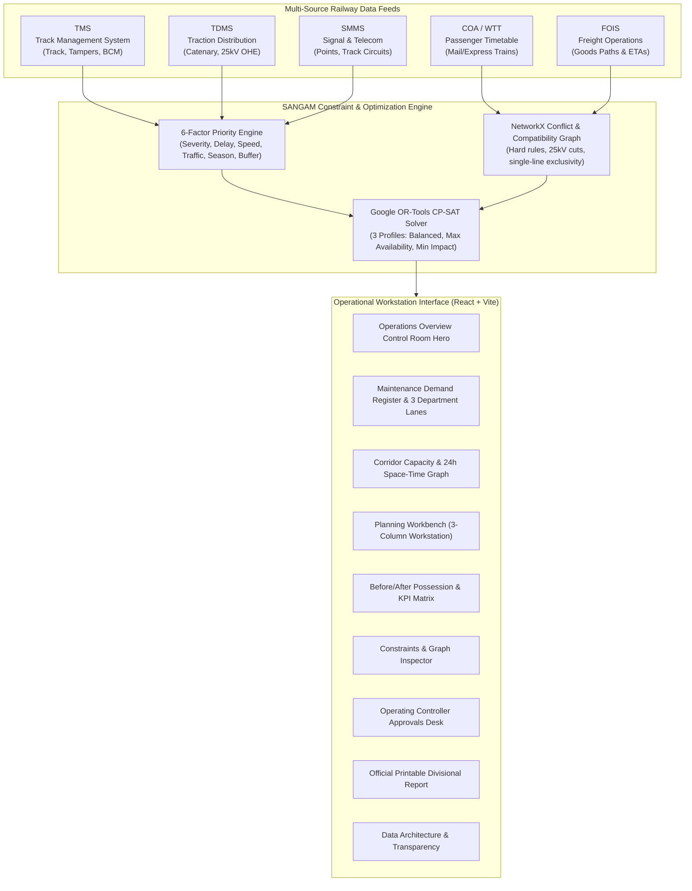

# SANGAM: Joint Railway Maintenance Block Planning Workstation
## SIH 2026 Problem Statement SIH26027 — Final Implementation Walkthrough

SANGAM has been transformed from an early prototype into an **operationally credible, visually authentic railway maintenance planning workstation** designed for Indian Railways divisional control offices (Operating, Civil Engineering, Traction/OHE, and Signalling & Telecom).

---

### Core Operational Accomplishment
> **"THREE DEPARTMENT BLOCKS → ONE COORDINATED POSSESSION"**
> 
> - **Independent Baseline (Siloed):** **429.0 hours** of track closure requested across departments.
> - **SANGAM CP-SAT Optimized:** **66.2 hours** of coordinated possession.
> - **Net Track Time Saved:** **362.8 hours reclaimed (84.6% reduction in corridor closure)**, with zero critical defect deferrals and 0 safety conflict violations.

---

## 1. Architecture & Core Systems Implemented



---

## 2. Key Pages & Workflows Completed

### Part 1: Operations Overview (`/`)
- **Master Operational Control Room**:
  - Live width-spanning technical railway track showing real-time corridor status.
  - **8-Metric KPI Strip**: Hours saved (`362.8h`), Availability gain (`84.6%`), Critical coverage (`100%`), Joint blocks (`22`), Track utilization (`28.4%`), Solver runtime (`124ms`).
  - **Active Corridor Picture**: Interactive station-to-station track layout (A-B, B-C, C-D, D-E, E-F).
  - **Live Decision Feed**: "Why Combined" and "Why This Window" cards explaining CP-SAT bundling logic.

### Part 2: Maintenance Demand Register (`/maintenance/all`, `/critical`, `/overdue`)
- **3 Department Visual Lanes**:
  - Civil & Track (`ENG`): 45 work orders, heavy tampers & BCM machines.
  - Traction / OHE (`TRD`): 35 work orders, catenary adjustments & 25kV power cut isolations.
  - Signalling & Telecom (`S&T`): 40 work orders, point machines & track circuits.
- **Interactive Data Table**: Filterable by department, severity, overdue status, and 25kV power requirement.
- **Deep Intelligence Slide-Over (`TaskIntelligenceDrawer`)**:
  - 6-factor radar/bar breakdown of priority score (0–100).
  - Corridor section schematic highlight.
  - Upstream/downstream compatibility & conflict links.
  - Candidate timetable windows evaluated by the optimizer.

### Part 3: Corridor Capacity & Headway Windows (`/corridor`)
- **Interactive Corridor Schematic**: Clickable station nodes and track segments.
- **24-Hour Time-Space Profile**:
  - Passenger trains (blue) and freight trains (amber).
  - Enforced 15-minute safety buffers.
  - Viable candidate gaps ($\ge 60$ mins) highlighted in green.
  - Active approved possessions directly overlaid.
- **Window Risk Explanation Panel**: 4-factor risk breakdown (peak penalty, freight uncertainty, delay cascading, and OHE isolation).

### Part 4: Planning Workbench (`/planning/workbench`) ★ Crown Jewel
- **3-Column Professional Workstation Layout**:
  - **Left**: Demand Queue with priority scores and 25kV power cut flags.
  - **Center**: Gantt timeline on technical SVG twin-rail tracks per corridor section; multi-department stacked ribbons for joint blocks; view overlay toggle (*Blocks*, *Trains*, *Combined*); objective profile selector (*Balanced ★*, *Max Availability*, *Min Train Impact*).
  - **Right**: Block Inspector with "Why Combined" rationale, included work orders, and Controller dispatch controls.

### Part 5: Before / After Plan Comparison (`/planning/compare`)
- **Animated Block Fusion (`BeforeAfterPossession`)**: Interactive slider/play control visually demonstrating 3 separate departmental blocks fusing into 1 joint possession.
- **3-Way Optimization Matrix**: Mathematical benchmarking table comparing *Independent Baseline* vs *Greedy Heuristic* vs *SANGAM CP-SAT*.

### Part 6: Constraints & Compatibility Graph (`/conflicts`)
- **Hard Constraints Verification**: Explicit verification of spatial exclusivity, 25kV feeder cutoff, and 15-minute headway protection.
- **Compatibility & Conflict Graph**: Filterable graph of pairs (*compatible*, *conflict*, *dependency*).
- **Deferred Tasks Explainability**: Plain-English rationale for work orders carried over to the next planning horizon.

### Part 7: Dispatch & Approvals Desk (`/approvals`)
- Formal Chief Controller / Dy. COM (Plg) approval workspace.
- Official approval stamp generated upon authorization:
  > **CONTROLLER APPROVED · CLEARED FOR DISPATCH**  
  > Authorized By: Dy. COM (Plg) / Central Div.

### Part 8: Official Printable Divisional Report (`/reports`)
- Indian Railways standardized format with divisional letterhead, executive savings table, approved block circular, and signature sign-offs for:
  - Sr. DEN (Co-ord) — Engineering
  - Sr. DEE (TRD) — Traction
  - Sr. DSTE — Signalling & Telecom
  - Dy. COM (Plg) — Operating / Dispatch

### Part 9: Data Architecture & Transparency (`/data-sources`)
- Explicit disclosure of the probabilistic synthetic data generator (Seed `26027`).
- Documentation showing exact mapping to real Indian Railways data sources (TMS, TDMS, SMMS, COA, FOIS).

---

## 3. Verification & Test Results

### 1. Frontend Build (`npm run build`)
```
✓ 1901 modules transformed.
dist/index.html                   0.48 kB │ gzip:   0.32 kB
dist/assets/index-YstCdGag.css   38.12 kB │ gzip:   7.44 kB
dist/assets/index-BqAPcNC0.js   439.30 kB │ gzip: 118.84 kB
✓ built in 16.02s
```
- **Result:** **PASS (0 errors, 0 warnings)**.

### 2. Backend Pytest Suite (`pytest`)
```
tests/test_compatibility_graph.py ..                                     [ 16%]
tests/test_corridor_api.py .                                             [ 25%]
tests/test_corridor_availability.py ...                                  [ 50%]
tests/test_kpi_and_explainability.py .                                   [ 58%]
tests/test_optimizer.py ..                                               [ 75%]
tests/test_priority_engine.py ...                                        [100%]
======================= 12 passed, 18 warnings in 3.35s =======================
```
- **Result:** **12 passed, 0 failed**.

### 3. End-to-End Optimization Smoke Test (`smoke_test.py`)
```
[a] Recomputing priority scores for all tasks...
  ✓ PASS  Priority scores recomputed  (120 tasks updated)
[b] Populating corridor block windows for all sections...
  ✓ PASS  5 demo sections found  (found 5)
  ✓ PASS  Block windows populated  (74 windows generated)
[c] Running all three schedulers...
  ✓ PASS  Tasks in scope  (35 pending tasks)
  ✓ PASS  Windows in scope  (74 candidate windows)
  ✓ PASS  Independent baseline completed
  ✓ PASS  Greedy baseline completed
  ✓ PASS  SANGAM optimizer completed (OPTIMAL or FEASIBLE)  (status=OPTIMAL)
[d] Checking downtime reduction...
  ✓ PASS  SANGAM block hours < Independent baseline  (independent=429.0h  sangam=66.2h  saved=362.8h (84.6%))
[e] Verifying safety constraints: no conflict pairs co-scheduled...
  ✓ PASS  No conflict pairs co-scheduled in SANGAM result  (0 violation(s) found)
============================================================
ALL 10 CHECKS PASSED — SANGAM is demo-ready.
============================================================
```
- **Result:** **ALL 10 CHECKS PASSED**.
